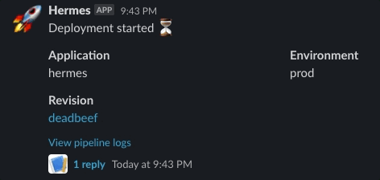

## Setup Slack service

### Create Slack application

In order to send notifications to your Slack channels, first you need to setup
a Slack application in your workspace. An application defines the permissions
and appearance of the bot that will interact with your channels. The end goal
of this step is to obtain a Slack authentication token that will be used by
Hermes to send notifications.

Choose one of the following two ways of creating the Slack application.

#### Use the manifest button

The button below will lead you to the app creation wizard in your Slack
workspace where you will get to review the permissions it is requesting before
adding it.

[Install Manifest :fontawesome-brands-slack:](
  https://api.slack.com/apps?new_app=1&manifest_yaml={{ import_file("services/slack/manifest.yaml") | urlencode }}
){ target=_blank .md-button .md-button--primary }

#### Manually create the application

If you do not really trust the button above, you can instead perform this
process manually.

1. Go to [Slack Applications](https://api.slack.com/apps)
2. Press the "Create New App" button
3. Choose the "From an app manifest" option
4. Select the workspace you wish to create the app in
5. Paste in the manifest below

```yaml title="manifest.yaml"
--8<-- "docs/content/services/slack/manifest.yaml"
```

### Obtain the OAuth Token

1. Go to [Slack Applications](https://api.slack.com/apps)
2. Select the newly created Hermes app
3. Click on "OAuth & Permissions" in the menu on the left
4. Copy the "Bot User OAuth Token" and save it for later

## Example

The provided example will generate following notification in your Slack channel.

<figure markdown>
  
</figure>

### Slack token

Create a secret containing the Slack token that you obtained using the [setup
guide](#obtain-the-oauth-token).

!!! warning "Access to secrets"

    This example assumes that your workflow will be run using a service account
    that has access to this secret.

```yaml
apiVersion: v1
kind: Secret
metadata:
  name: slack-token
stringData:
  token: # Your Slack token goes here
```

### Template

Add the following template:

```yaml

apiVersion: v1
kind: ConfigMap
metadata:
  name: hermes-template-slack-default
data:
  primary: |
    {
      "text": "{{message}}",
      "blocks": [
        {
          "type": "section",
          "text": {
            "type": "mrkdwn",
            "text": "{{message}}"
          }
        },
        {
          "type": "section",
          "fields": [
            {
              "type": "mrkdwn",
              "text": "*Application*\n{{app}}"
            },
            {
              "type": "mrkdwn",
              "text": "*Environment*\n{{env}}"
            }
          ]
        },
        {
          "type": "section",
          "fields": [
            {
              "type": "mrkdwn",
              "text": "*Revision*\n<{{revision_url}}|{{revision_sha}}>"
            }
          ]
        },
        {
          "type": "context",
          "elements": [
            {
              "type": "mrkdwn",
              "text": "<{{log_url}}|View pipeline logs>"
            }
          ]
        }
      ]
    }
  secondary: |
    {"text": "{{message}}"}

```

### Send notification

Fill in the channel name in the workflow below and submit it.

```yaml

apiVersion: argoproj.io/v1alpha1
kind: Workflow
metadata:
  generateName: notifications-test-
spec:
  entrypoint: main
  templates:
    - name: main
      steps:
        - - name: setup-notifications
            template: hermes-setup

        - - name: pre-notification
            template: hermes-notify
            arguments:
              parameters:
                - name: message
                  value: "Deployment started :hourglass_flowing_sand:"

        - - name: hello
            template: hello

        - - name: post-notification
            template: hermes-notify
            arguments:
              parameters:
                - name: message
                  value: "Deployment succeeded :white_check_mark:"

    - name: hermes-setup
      plugin:
        hermes:
          setup:
            alias: default
            service: slack
            config:
              token: slack-token
              icon_emoji: ":rocket:"

    - name: hermes-notify
      inputs:
        parameters:
          - name: message
      plugin:
        hermes:
          notify:
            target: default
            template: hermes-template-slack-default
            config:
              channel: # Your Slack channel name goes here
            context:
              message: "{{inputs.parameters.message}}"
              app: hermes
              env: prod
              revision_sha: "deadbeef"
              revision_url: "https://google.com"
              log_url: "https://google.com"

    - name: hello
      container:
        image: docker/whalesay
        command: [cowsay]
        args: ["hello world"]

```

## Reference

### Setup config


| Field | Required | Description |
| - | - | - |
| token | yes | The name of the secret containing the Slack OAuth token. The token has to be stored in the `token` field in the secret. |
| icon_emoji | no | A shortcode for the emoji to use as the bot avatar, e.g. `:rocket`. |


### Notify config

| Field | Required | Description |
| - | - | - |
| channel | yes | The name of the channel to send the notification to, .e.g `argo-alerts`. |
